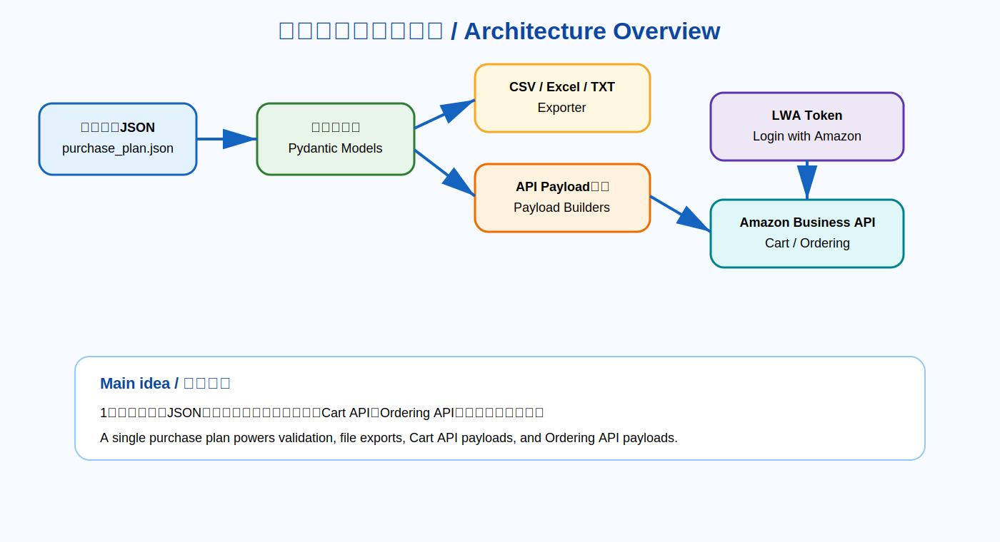
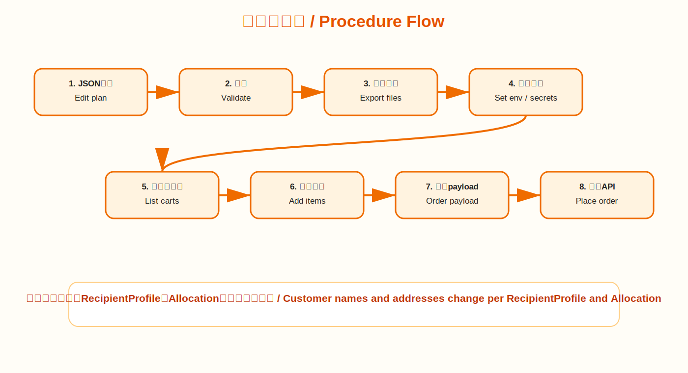
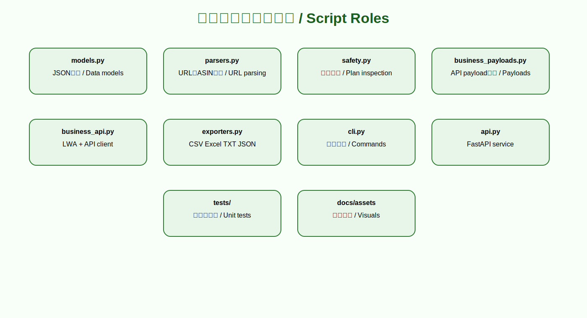
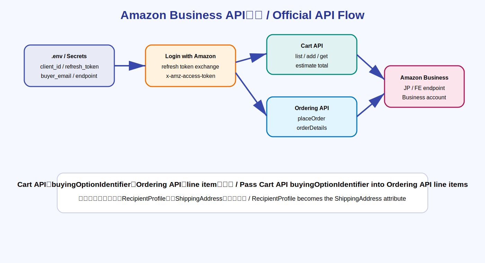
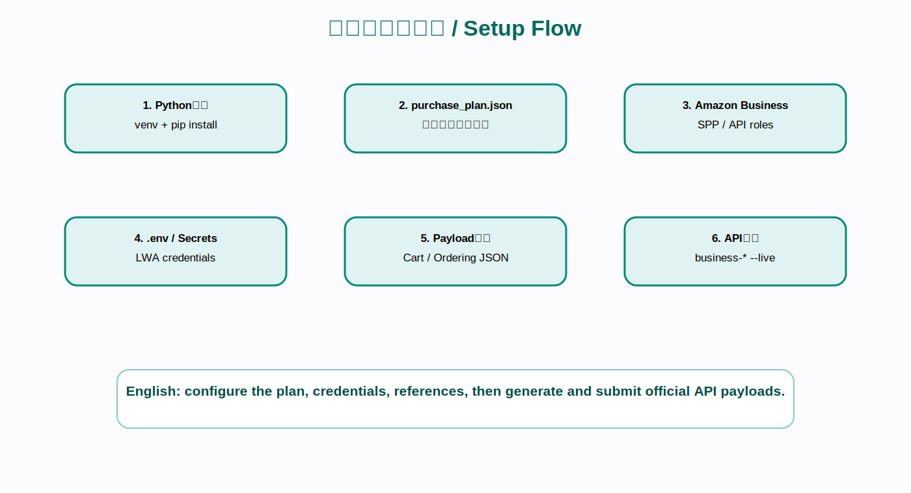
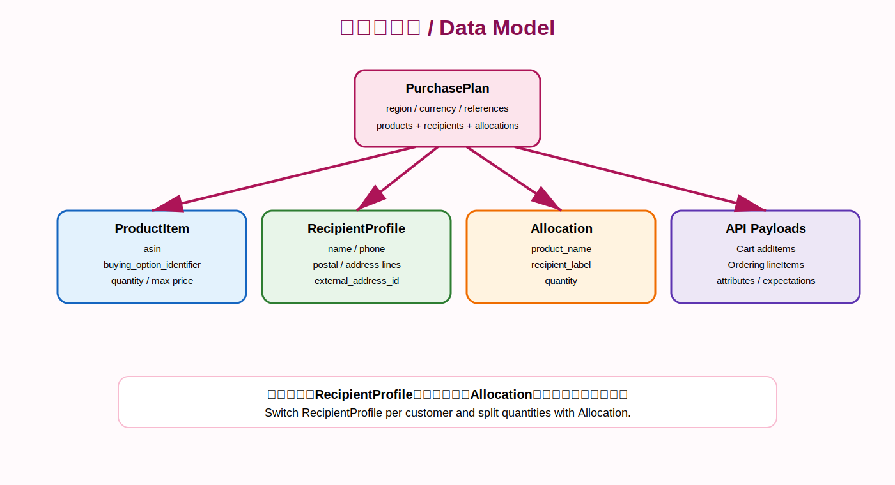

# Amazon Business Purchase Automation Assistant

Amazon Businessの公式APIを前提に、商品、数量、顧客名、配送先、購入グループ、支払い参照、価格上限を1つの購入計画として管理し、Cart API / Ordering API向けpayload、CSV、Excel、TXTを生成するPythonアプリです。

English: This project prepares structured Amazon Business purchase plans, customer delivery profiles, Cart API payloads, Ordering API payloads, CSV, Excel, and text outputs for procurement automation.

## Visual overview / 全体像



## Procedure flow / 処理の流れ



## Script map / 各スクリプトの役割



## Amazon Business API flow / 公式API連携



## Setup flow / 初期準備



## Data model / データ構造



## 公式APIについて / Official API notes

Amazon Business Ordering APIは、購入システムとAmazon Businessを連携し、Amazon Businessサイトを開かずに注文プロセスを自動化するための公式APIです。Cart APIは、外部システムからAmazon Businessのカートを作成・変更・取得し、送料・税を含む見積りを計算できます。Cart APIで返された `buyingOptionIdentifier` をOrdering APIに渡すことで、カート側の価格・数量条件を注文payloadに引き継げます。

English: Amazon Business Ordering API supports order placement from a purchasing system. Cart API supports cart management and total cost estimation, and the Cart API `buyingOptionIdentifier` should be used in the Ordering API payload when ordering from a cart-derived workflow.

## Main commands / 主要コマンド

```bash
python -m venv .venv
source .venv/bin/activate
pip install -e ".[dev]"
```

```bash
purchase-prep validate --input sample_data/purchase_plan.json
purchase-prep export --input sample_data/purchase_plan.json --output outputs
purchase-prep business-cart-payload --input sample_data/purchase_plan.json --output outputs/cart-add-items.json
purchase-prep business-order-payload --input sample_data/purchase_plan.json --recipient-label customer-a --output outputs/order-payload.json
```

FastAPI:

```bash
purchase-prep serve --host 127.0.0.1 --port 8000
```

## Live API environment / 本番・Sandbox接続設定

`.env.example` をコピーして、実値はローカル環境変数またはGitHub Actions Secretsに設定します。

```bash
cp .env.example .env
```

Required environment variables:

- `AMAZON_BUSINESS_CLIENT_ID`
- `AMAZON_BUSINESS_CLIENT_SECRET`
- `AMAZON_BUSINESS_REFRESH_TOKEN`
- `AMAZON_BUSINESS_REGION`
- `AMAZON_BUSINESS_BASE_URL`
- `AMAZON_BUSINESS_BUYER_EMAIL`
- `AMAZON_BUSINESS_USER_AGENT`

Optional references:

- `AMAZON_BUSINESS_BUYING_GROUP_REFERENCE`
- `AMAZON_BUSINESS_PAYMENT_METHOD_REFERENCE`
- `AMAZON_BUSINESS_BUYER_REFERENCE`

Live call example:

```bash
purchase-prep business-list-carts --region JP --live
purchase-prep business-add-items --input sample_data/purchase_plan.json --cart-id cart-123 --region JP --live
purchase-prep business-place-order --payload outputs/order-payload.json --live
```

## GPT-Image 2 visual guide

画像作成用のプロンプト集は `docs/gpt_image_2_visual_guide.md` に入れています。README内のSVG画像はGitHub上でそのまま表示される固定図で、同じ内容をGPT-Image 2の最新モデルに渡して高解像度版の説明画像を作れる構成にしています。

English: `docs/gpt_image_2_visual_guide.md` contains GPT-Image 2 prompts for regenerating the visual guide as high-resolution explanatory images.

## GitHub Actions

push、pull_request、workflow_dispatchでCIが実行されます。テスト、lint、サンプルCSV/Excel/TXT/JSON生成、artifact uploadを含みます。

Artifact name: `purchase-prep-outputs`
