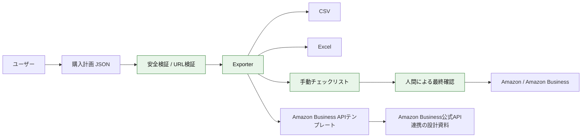

# Amazon Purchase Prep Assistant

Amazonの購入を**安全に準備**するためのローカル支援ツールです。商品URL、数量、配送先候補、予算上限を1つの購入計画として管理し、CSV / Excel / TXT / Amazon Business公式API向けテンプレートに出力します。

> 重要: このリポジトリは、Amazonのウェブ画面を自動操作したり、チェックアウト、住所入力、購入確定、CAPTCHA回避、ブロック回避、人間風操作を行ったりするツールではありません。購入前の整理・検証・手動確認を支援するためのものです。

## できること

- Amazon商品URL、短縮URL、ASIN、数量、予算、メモの整理
- 配送先候補のテンプレート管理
- 購入計画の検証
- CSV / Excel / TXT の出力
- Amazon Business Cart API / Ordering API を使う場合のJSONテンプレート生成
- GitHub Actionsでサンプル計画を検証し、成果物をartifactとして出力

## しないこと

- Amazon.co.jpのブラウザ自動操作
- カート投入、購入確認画面への遷移、購入確定
- 住所フォームの自動入力
- CAPTCHA、2FA、ブロック、bot検知の回避
- 人間の挙動に見せかけるランダム操作
- Amazonの画面変更に追従するスクレイピング実装

## 全体アーキテクチャ



GPT Imageの最新モデルで図解資料を作る場合のプロンプト例:

> 日本語の初心者向け技術図解。Amazon Purchase Prep Assistantの安全な購入準備フローを描く。左から「購入計画JSON」「安全検証」「CSV/Excel/TXT/APIテンプレート出力」「人間の最終確認」「Amazon Business公式APIまたは手動購入」。禁止領域として「ブラウザ自動操作」「ブロック回避」「CAPTCHA回避」「購入確定」を赤枠で分離。やさしい配色、アイコン付き、横長16:9。

## セットアップ

```bash
python -m venv .venv
source .venv/bin/activate
pip install -e ".[dev]"
```

Windows PowerShellの場合:

```powershell
py -m venv .venv
.\.venv\Scripts\Activate.ps1
pip install -e ".[dev]"
```

## 使い方

サンプル購入計画を検証します。

```bash
purchase-prep validate --input sample_data/purchase_plan.json
```

CSV / Excel / TXT / Amazon Business APIテンプレートをまとめて出力します。

```bash
purchase-prep export --input sample_data/purchase_plan.json --output outputs
```

FastAPIサーバーを起動します。

```bash
purchase-prep serve --host 127.0.0.1 --port 8000
```

API確認:

```bash
curl http://127.0.0.1:8000/health
```

## 入力JSON例

```json
{
  "project_name": "prime-sale-manual-review-sample",
  "products": [
    {
      "name": "Amazon short link sample",
      "url": "https://amzn.asia/d/0a7kZ6KA",
      "quantity": 2,
      "max_unit_price_jpy": 3000,
      "note": "短縮URLはASINを抽出できないため、手動確認対象"
    }
  ],
  "recipients": [
    {
      "label": "home",
      "recipient_name": "山田 太郎",
      "postal_code": "100-0001",
      "prefecture": "東京都",
      "city": "千代田区",
      "line1": "千代田1-1",
      "line2": "サンプルマンション101",
      "phone": "03-0000-0000"
    }
  ],
  "allocations": [
    {"product_name": "Amazon short link sample", "recipient_label": "home", "quantity": 2}
  ],
  "safety_mode": "manual_review_only"
}
```

## 本番で必要なもの

個人向けAmazon.co.jpのウェブ画面を自動操作する運用はこのツールの対象外です。法人購買を公式に自動化したい場合は、Amazon Business側で次の準備が必要です。

- Amazon Businessアカウント
- Amazon Business APIの利用権限
- OAuth / Login with Amazon 設定
- Buying Group、支払い方法、配送先、ユーザー設定
- Cart API / Ordering API の利用可否確認
- 組織内の承認フロー、注文上限、配送先ルール

このリポジトリに実シークレット値は保存しません。必要な場合は環境変数またはGitHub Actions Secretsに以下の名前だけを登録してください。

- `AMAZON_BUSINESS_CLIENT_ID`
- `AMAZON_BUSINESS_CLIENT_SECRET`
- `AMAZON_BUSINESS_REFRESH_TOKEN`
- `AMAZON_BUSINESS_BUYING_GROUP_ID`

## GitHub Actions成果物

CIはpush、pull_request、workflow_dispatchで実行されます。サンプル購入計画を検証し、`purchase-prep-outputs` artifactとしてCSV / Excel / TXT / JSONテンプレートを生成します。

## 主要ファイル

- `src/purchase_prep_assistant/cli.py` — CLI
- `src/purchase_prep_assistant/api.py` — FastAPI
- `src/purchase_prep_assistant/models.py` — 入力モデル
- `src/purchase_prep_assistant/safety.py` — 安全ポリシーとURL検証
- `src/purchase_prep_assistant/exporters.py` — CSV / Excel / TXT / JSON出力
- `docs/architecture.md` — 詳細設計
- `docs/setup.md` — 初期設定ガイド
- `docs/amazon_business_api_research.md` — 公式API/MCP調査メモ

## 開発

```bash
ruff check .
pytest
purchase-prep export --input sample_data/purchase_plan.json --output outputs
```
