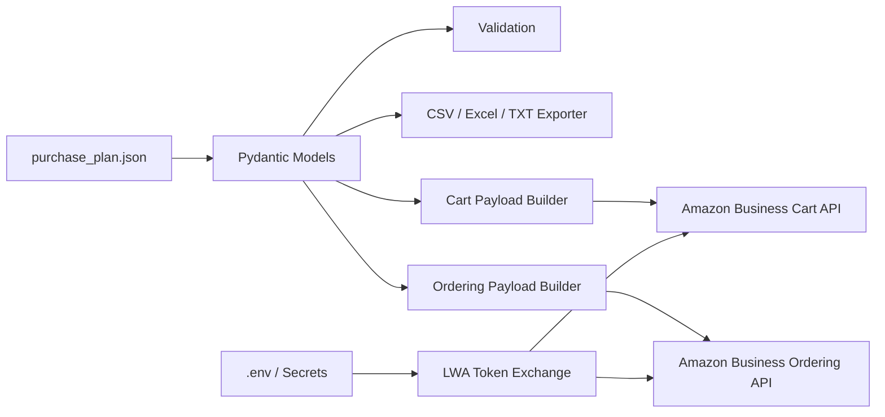

# Architecture / アーキテクチャ

## 日本語

このアプリは、Amazon Businessの公式APIを使った購入作業を構造化するためのPythonプロジェクトです。中心になる入力は `purchase_plan.json` です。商品、ASIN、buying option、数量、顧客別配送先、購入グループ、支払い参照、PO番号を1つのJSONにまとめ、CLI / FastAPI / Exporter / Amazon Business API Clientが同じモデルを参照します。

## English

This application structures Amazon Business purchase automation around a single `purchase_plan.json`. Products, ASINs, buying options, quantities, recipient addresses, buying group references, payment references, and purchase order numbers are shared by the CLI, FastAPI service, exporters, and Amazon Business API client.

## Component diagram

## File roles / ファイル役割

| File | Role |
|---|---|
| `models.py` | Purchase plan, product, recipient, allocation models |
| `business_payloads.py` | Cart API and Ordering API request payload generation |
| `business_api.py` | Login with Amazon token exchange and official API HTTP client |
| `exporters.py` | CSV, Excel, TXT, JSON bundle export |
| `cli.py` | Local commands for validation, export, payload generation, live API calls |
| `api.py` | FastAPI endpoints for app/server integration |

## Procedure / 処理手順

1. Fill `purchase_plan.json` with products, recipients, and references.
2. Run `purchase-prep validate`.
3. Run `purchase-prep business-cart-payload` or `purchase-prep business-order-payload`.
4. Configure environment variables from `.env.example`.
5. Use `business-list-carts`, `business-add-items`, and `business-place-order` with official Amazon Business credentials.

## GPT-Image 2 prompt

See `docs/gpt_image_2_visual_guide.md` for high-resolution image prompts matching the SVG diagrams in this repository.
