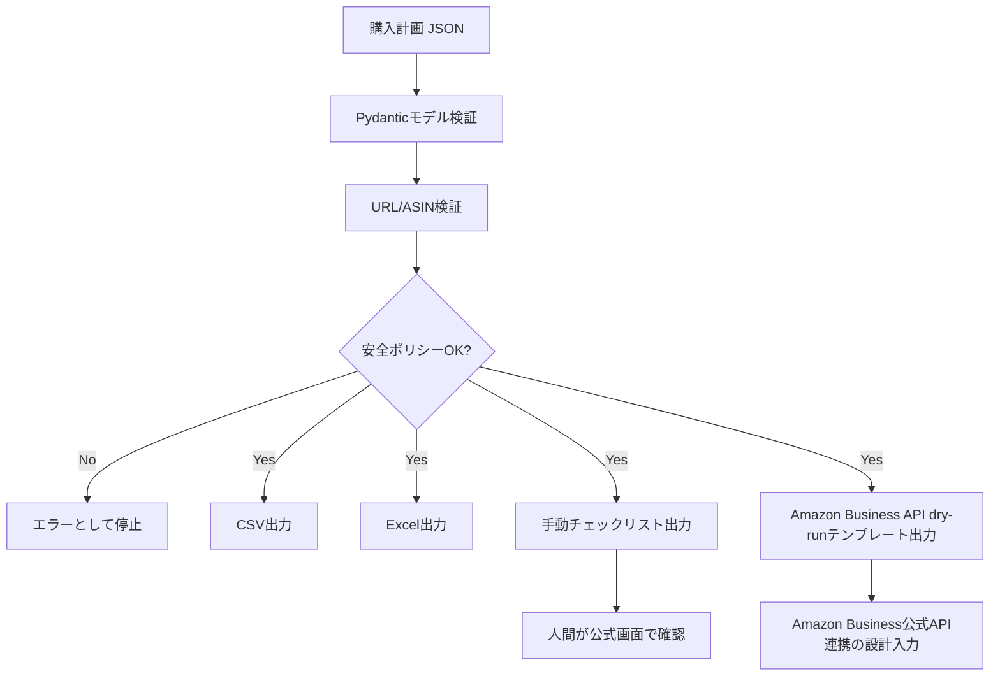

# Architecture

## 目的

Amazon Purchase Prep Assistantは、Amazon / Amazon Businessで購入前に必要になる情報整理を自動化するための支援ツールです。購入画面のブラウザ操作やチェックアウト自動化ではなく、購入計画の検証、配送先候補の整理、CSV/Excel/TXT/APIテンプレートの出力に限定します。

## 設計方針

- ローカルファイルを入力にし、外部サイトへアクセスしない
- Amazon短縮URLは解決しない
- チェックアウトURLやカートURLは入力として拒否する
- 実際の購入・住所入力・支払い操作は人間が公式画面で確認する
- 公式API連携はAmazon Business APIの権限取得後にのみ行う

## 処理フロー

## コンポーネント

### CLI

`purchase-prep validate` と `purchase-prep export` を提供します。GitHub Actionsからも同じCLIを呼び出します。

### FastAPI

`/health`、`/policy`、`/validate-plan`、`/export-plan` を提供します。ブラウザ操作やチェックアウトAPIは提供しません。

### Safety layer

`src/purchase_prep_assistant/safety.py` が安全境界を担当します。チェックアウトURL、カートURL、購入フローURLを拒否し、`manual_review_only` のみ許可します。

### Exporter

`src/purchase_prep_assistant/exporters.py` がCSV、Excel、TXT、Amazon Business APIテンプレートを生成します。

## GitHub Actions / CI

CI artifact `purchase-prep-outputs` には、サンプル購入計画から生成したCSV / Excel / TXT / JSONが含まれます。

## GPT Image図解プロンプト

> 横長16:9、日本語、初心者向け。安全な購入準備アプリのアーキテクチャ図。入力: 購入計画JSON。中央: Pydantic検証、URL/ASIN検証、安全ポリシー。出力: CSV、Excel、手動チェックリスト、Amazon Business API dry-runテンプレート。右端: 人間による最終確認、公式Amazon Business API。赤い禁止領域: ブラウザ自動操作、CAPTCHA回避、ブロック回避、購入確定クリック。やさしい配色、明確な矢印、アイコン付き。

## 今後の拡張

- Amazon Business API sandboxクライアント
- 社内承認ワークフロー連携
- 予算上限・数量上限の組織ルール化
- 商品候補の重複検知
- 受取人別の梱包/配送メモ出力
